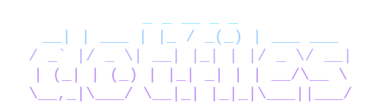

<div align="center">

<picture>
  <source media="(prefers-color-scheme: dark)" srcset=".github/assets/logo-dark.svg">
  <source media="(prefers-color-scheme: light)" srcset=".github/assets/logo-light.svg">
  
</picture>

**Personal configuration files for zsh, tmux, neovim, ghostty, git and much more.**

[](https://github.com/undont/dotfiles/actions)
[](https://github.com/undont/dotfiles/actions/workflows/ci.yml)
[](LICENCE)
[](https://neovim.io/)
[](https://github.com/tmux/tmux)
[]()
[]()

[Quick Start](#quick-start) · [How it works](#how-it-works) · [Features](#features) · [Themes](#themes) · [Keybindings](#keybindings) · [Docs](#documentation)

</div>

---

## Quick Start

Prerequisites: macOS or Linux. On a fresh macOS, run `xcode-select --install` first.

```bash
git clone https://github.com/undont/dotfiles.git ~/dotfiles
cd ~/dotfiles
./install.sh            # full install (default)
```

### Install presets

| Preset      | Components                                        | Use case                          |
| ----------- | ------------------------------------------------- | --------------------------------- |
| `--minimal` | zsh, tmux                                         | servers, remote machines, SSH     |
| `--core`    | + nvim, ghostty, AI/CLI tools, launchers          | Linux desktop, cross-platform dev |
| `--full`    | + Hammerspoon, Karabiner, Raycast, music-presence | macOS power user (default)        |

The installer backs up existing configs, installs Homebrew packages filtered by preset, creates symlinks, sets up plugin managers, and runs a health check. Your preset is saved so `dotfiles update` remembers it.

Other flags: `--skip-brew`, `--skip-backup`, `--check-only`. See the [Installation Guide](docs/INSTALLATION-GUIDE.md) for a walkthrough of each step.

---

## How it works

The setup is layered: a shared base lives in this repo and gets symlinked into place, and tools that support it (tmux, ghostty, nvim, lazygit, gh-dash, hammerspoon) load a `local.*` file on top that `dotfiles update` never touches. Clone the repo, keep your tweaks in the local files, and run `dotfiles update` to pull upstream changes; your overrides survive. Fork it if you really want to make it your own or take the base in a different direction.

Version-gated scripts in [`scripts/migrations/`](scripts/migrations) run automatically during `dotfiles update` to handle changes the normal installer can't. They're idempotent and only run once per version range.

Built around staying on the keyboard: `` ` `` as the tmux prefix, fzf pickers everywhere, vim motions under space as `<leader>` in nvim, and zsh aliases for anything frequent enough to warrant one. Used daily across personal and work machines on macOS and Linux.

---

## Features

### Ghostty

Configured as a clean input layer rather than a productivity surface: keybind remappings emit consistent escape sequences across macOS and Linux (via a `{{PLATFORM_MOD}}` template), so the same tmux and nvim keybinds work identically on both platforms. The colour scheme follows the active dotfiles theme, and `~/.config/ghostty/local` is loaded last so fonts and personal tweaks survive updates.

### Neovim

Modular config based on kickstart.nvim with lazy.nvim, Treesitter, and Mason-managed language servers. Startup is roughly 100ms.

- **LSP** for TypeScript, Go, Python, Lua, C#/.NET (Roslyn), C/C++/Objective-C, Swift, ESLint, Bash, CSS/Tailwind, HTML and YAML, with formatting, linting, and codelldb debugging for the C family and Swift
- **SonarLint** as a second LSP client, with connected mode and per-project rule overrides. See [docs/SONARLINT.md](docs/SONARLINT.md)
- **Diffs and PR review** through differ.nvim (my own plugin): side-by-side diffs, file history, staging, GitHub PR review, merge conflict resolution, and diff-by-ticket, all through one renderer
- **Build picker** auto-detects Go, TypeScript, .NET and Makefile projects and runs the build into the quickfix list
- **Tests** via Neotest (Go, Vitest/Bun, Jest/React Native, pytest), with .NET handled by easy-dotnet's own runner
- **Binary object viewer**: opening a `.o`, `.a`, `.dylib` or `.so` renders demangled symbols, disassembly and a hex dump instead of raw bytes
- **Self-contained colourschemes** with no plugin dependencies, so generated themes drop in as plain Lua files
- `~/.config/nvim/local.lua` loads before plugin specs, so `vim.g.*` is visible to them

### Tmux

`` ` `` as the prefix, vim-style navigation between panes and windows, and a searchable key cheatsheet (`` ` ? ``) if you forget anything.

- **Session save and restore** with resurrect + continuum, extended to split the combined save into per-session backups, so one session can be restored without bringing back everything else
- **fzf pickers everywhere**: sessions, windows, running nvim instances, AI agent instances, themes, and URLs from scrollback
- **Multi-agent alerts** show coloured indicators when Claude, OpenCode, Copilot or Codex need attention, clearing when you switch to the session. The Claude switcher also shows live per-instance state and how long it has been waiting. See [docs/AGENT-HOOKS.md](docs/AGENT-HOOKS.md)
- **Process list** is one fzf switcher over everything you're watching: live commands with elapsed time plus finished ✓/✗ rows, with jump, stop, clear and rerun
- **Undo** restores the most recently closed pane or window with directory, scrollback and layout intact
- **Session launchers** cover `dev`, `github`, `btop`, `docker`, `dotfiles` and `config`, with a wizard to scaffold new ones. Also reachable from a plain shell with `tl`

### Zsh

- **Powerlevel10k** prompt with instant prompt and git status
- **Performance**: lazy-loaded completions, fnm over nvm, and cached eval for direnv and fzf, with median startup benchmarked in CI on every push (the job fails above 125ms)
- **carapace** as the completion bridge, so modern completion specs work without per-tool wrangling
- **zoxide** for a `cd` that learns the directories you actually use
- **Clipboard**: `<cmd> | clip` copies and bare `clip` pastes, on macOS and Linux alike, following the live display server and falling back to OSC 52 so it works headless and over SSH
- **Man pages** open in nvim, so search, `K` and yank behave as in any other buffer
- Git, navigation and editing aliases throughout; run `dot aliases` for the full list

### Dotfiles CLI

```bash
dotfiles update    # smart incremental update (only re-runs changed steps)
dotfiles status    # version, sync status, and local changes
dotfiles health    # full health check (symlinks, plugins, env vars)
dotfiles links     # show all managed symlinks and their status
dotfiles theme     # list, switch, or generate themes
dotfiles export    # export your local layer to a private repo
dotfiles import    # import your local layer from a private repo
dotfiles local     # manage the private local-layer repo
dotfiles aliases   # browse all shell aliases and shortcuts
dotfiles notes     # browse the changelog in a pager
dotfiles version   # current version, release/update dates, preset, and theme
dotfiles edit      # open dotfiles in $EDITOR
```

`dot` is a shorthand for `dotfiles`. Both have full tab completion.

---

## Themes

From within tmux, `` ` t `` opens an fzf picker over the hand-crafted set and Ghostty's themes; selecting one re-skins tmux, ghostty, neovim and fzf with no restart; gh-dash and yazi pick up the new theme on their next launch.

Two sources feed the picker:

- **14 hand-crafted themes** with tuned palettes, all checked against WCAG 2.1 contrast ratios
- **~460 Ghostty themes** generatable on the fly, deriving semantic roles from a Ghostty palette and correcting for contrast

```bash
dotfiles theme                                 # list available themes
dotfiles theme switch dracula                  # switch by name
dotfiles theme generate "Catppuccin Latte"     # generate from a Ghostty palette
```

Themes are pure colour palettes. Anything else you want to customise goes in the per-tool `local.*` files, which are never touched by `dotfiles update`.

See [docs/THEME-SYSTEM.md](docs/THEME-SYSTEM.md) for the architecture, the generator, and statusline integration for AI CLI agents. See [docs/LOCAL-LAYER.md](docs/LOCAL-LAYER.md) for the override files and syncing them between machines.

---

## Brewfile

Three flavours selected at install time (`--minimal`, `--core`, `--full`), filtered from a single [`Brewfile`](Brewfile) via preset markers. Browse it directly for the full list.

My own tools installed by it (gh-bench as a `gh` extension, the rest from the Brewfile):

| Tool                                               | What it does                                                                               |
| -------------------------------------------------- | ------------------------------------------------------------------------------------------ |
| [supplyscan](https://github.com/undont/supplyscan) | Go CLI / MCP that scans JS-ecosystem projects for vulnerabilities and supply-chain attacks |
| [jiru](https://github.com/undont/jiru)             | Bubble Tea TUI for managing Jira issues and Confluence pages                               |
| [gh-bench](https://github.com/undont/gh-bench)     | `gh` CLI extension for benchmarking GitHub Actions and tracking failures                   |

Homebrew is set to require explicit trust for non-official taps (`HOMEBREW_REQUIRE_TAP_TRUST=1`). The taps these tools come from are trusted during install; to add your own, approve it once with `brew trust --tap <user/repo>`.

The full preset adds macOS-only pieces (Hammerspoon window management, Karabiner remapping, Raycast) and Linux picks up keyd as the Karabiner equivalent.

---

## Keybindings

| Action           | Keybinding                                 |
| ---------------- | ------------------------------------------ |
| Tmux prefix      | <kbd>`</kbd>                               |
| Tmux cheatsheet  | <kbd>`</kbd> <kbd>?</kbd>                  |
| Session switcher | <kbd>`</kbd> <kbd>s</kbd>                  |
| Launcher picker  | <kbd>`</kbd> <kbd>p</kbd>                  |
| Process list     | <kbd>`</kbd> <kbd>Shift</kbd>+<kbd>P</kbd> |
| Theme picker     | <kbd>`</kbd> <kbd>t</kbd>                  |
| Undo pane/window | <kbd>Opt/Alt</kbd>+<kbd>u</kbd>            |
| Nvim leader      | <kbd>Space</kbd>                           |
| Nvim cheatsheet  | <kbd>Space</kbd> <kbd>?</kbd>              |
| History search   | <kbd>Ctrl</kbd>+<kbd>R</kbd>               |
| Directory history| <kbd>Opt/Alt</kbd>+<kbd>A</kbd>            |

The full sets are all available in-product, and stay current because they're generated from the config rather than transcribed:

- **Tmux**: `` ` ? `` opens the searchable cheatsheet
- **Neovim**: <kbd>Space</kbd> <kbd>?</kbd> opens the searchable cheatsheet
- **Zsh**: `dot aliases` browses every alias, function and binding

---

## Uninstalling

```bash
./scripts/install/uninstall.sh                                          # remove symlinks only
./scripts/install/uninstall.sh --restore-backup                         # restore original configs
./scripts/install/uninstall.sh --restore-backup --remove-brew-packages  # full uninstall
```

---

## Documentation

- [Agent Hooks](docs/AGENT-HOOKS.md): setup guide for agent alert hooks (Claude Code, OpenCode, Codex, Copilot)
- [Command Exit Alerts](docs/CMD-ALERTS.md): auto ✓/✗ alerts when commands finish in other windows
- [Installation Guide](docs/INSTALLATION-GUIDE.md): detailed walkthrough of each installation step
- [Local Layer](docs/LOCAL-LAYER.md): override files, and syncing them between your machines
- [SonarLint](docs/SONARLINT.md): SonarQube/SonarCloud diagnostics in Neovim
- [Theme System](docs/THEME-SYSTEM.md): how themes work, the Ghostty theme generator, and WCAG contrast checks
- [Troubleshooting](docs/TROUBLESHOOTING.md): common issues and solutions

---

## Licence

[MIT](LICENCE)
